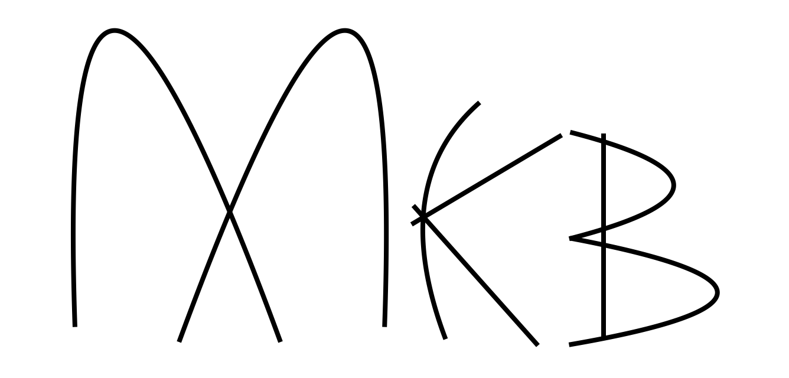
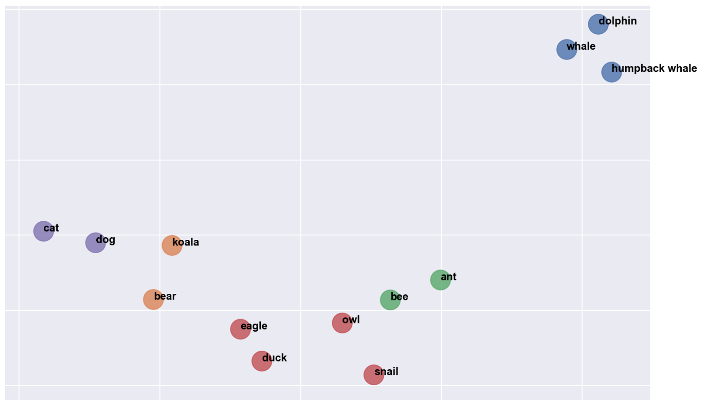

<div align="center">
    
</div>
</br>

<div align="center">
    
</div>
</br>

<p align="center">
  <code>mkb</code> is a library dedicated to <b>knowledge graph embeddings.</b> The purpose of this library is to provide modular tools using PyTorch.
</p>
</br>

## Table of contents

- [Table of contents](#table-of-contents)
- [👾 Installation](#-installation)
- [⚡️ Quickstart](#-quickstart)
- [🗂 Datasets](#-datasets)
- [🤖 Models](#-models)
- [🎭 Negative sampling](#-negative-sampling)
- [🤖 Train your model](#-train-you-model)
- [📊 Evaluation](#-evaluation)
- [🤩 Get embeddings](#-get-embeddings)
- [🔍 Transformers](#-transformers)
- [🧰 Development](#-development)
- [👍 See also](#-see-also)
- [🗒 License](#-license)

## 👾 Installation

You should be able to install and use this library with any Python version above 3.6.

```sh
pip install git+https://github.com/raphaelsty/mkb
```

## ⚡️ Quickstart:

Load or initialize your dataset as a list of triplets:

```python
train = [
    ('🦆', 'is a', 'bird'),
    ('🦅', 'is a', 'bird'),

    ('🦆', 'lives in', '🌳'),
    ('🦉', 'lives in', '🌳'),
    ('🦅', 'lives in', '🏔'),

    ('🦉', 'hability', 'fly'),
    ('🦅', 'hability', 'fly'),

    ('🐌', 'is a', 'mollusc'),
    ('🐜', 'is a', 'insect'),
    ('🐝', 'is a', 'insect'),

    ('🐌', 'lives in', '🌳'),
    ('🐝', 'lives in', '🌳'),

    ('🐝', 'hability', 'fly'),

    ('🐻', 'is a', 'mammal'),
    ('🐶', 'is a', 'mammal'),
    ('🐨', 'is a', 'mammal'),

    ('🐻', 'lives in', '🏔'),
    ('🐶', 'lives in', '🏠'),
    ('🐱', 'lives in', '🏠'),
    ('🐨', 'lives in', '🌳'),

    ('🐬', 'lives in', '🌊'),
    ('🐳', 'lives in', '🌊'),

    ('🐋', 'is a', 'marine mammal'),
    ('🐳', 'is a', 'marine mammal'),
]

valid = [
    ('🦆', 'hability', 'fly'),
    ('🐱', 'is_a', 'mammal'),
    ('🐜', 'lives_in', '🌳'),
    ('🐬', 'is_a', 'marine mammal'),
    ('🐋', 'lives_in', '🌊'),
    ('🦉', 'is a', 'bird'),
]
```

Train your model to make coherent embeddings for each entities and relations of your dataset using a pipeline:

```python
from mkb import datasets
from mkb import models
from mkb import losses
from mkb import sampling
from mkb import evaluation
from mkb import compose

import torch

_ = torch.manual_seed(42)

# Set device = 'cuda' if you own a gpu.
device = 'cpu'

dataset = datasets.Dataset(
    train      = train,
    valid      = valid,
    batch_size = 24,
)

model = models.RotatE(
    entities   = dataset.entities,
    relations  = dataset.relations,
    gamma      = 3,
    hidden_dim = 200,
)

model = model.to(device)

optimizer = torch.optim.Adam(
    filter(lambda p: p.requires_grad, model.parameters()),
    lr = 0.003,
)

negative_sampling = sampling.NegativeSampling(
    size          = 24,
    train_triples = dataset.train,
    entities      = dataset.entities,
    relations     = dataset.relations,
    seed          = 42,
)

validation = evaluation.Evaluation(
    true_triples = dataset.true_triples,
    entities     = dataset.entities,
    relations    = dataset.relations,
    batch_size   = 8,
    device       = device,
)

pipeline = compose.Pipeline(
    epochs                = 100,
    eval_every            = 50,
    early_stopping_rounds = 3,
    device                = device,
)

pipeline = pipeline.learn(
    model      = model,
    dataset    = dataset,
    evaluation = validation,
    sampling   = negative_sampling,
    optimizer  = optimizer,
    loss       = losses.Adversarial(alpha=1)
)
```
<br>

<details><summary>Plot embeddings:</summary>

```python
from sklearn import manifold

from sklearn import cluster

import seaborn as sns

import matplotlib.pyplot as plt

import pandas as pd

emojis_tokens = {
    '🦆': 'duck',
    '🦅': 'eagle',
    '🦉': 'owl',
    '🐌': 'snail',
    '🐜': 'ant',
    '🐝': 'bee',
    '🐻': 'bear',
    '🐶': 'dog',
    '🐨': 'koala',
    '🐱': 'cat',
    '🐬': 'dolphin',
    '🐳': 'whale',
    '🐋': 'humpback whale',
}

embeddings = pd.DataFrame(model.embeddings['entities']).T.reset_index()

embeddings = embeddings[embeddings['index'].isin(emojis_tokens)].set_index('index')

tsne = manifold.TSNE(n_components = 2, random_state = 42, n_iter=1500, perplexity=3, early_exaggeration=100)

kmeans = cluster.KMeans(n_clusters = 5, random_state=42)

X = tsne.fit_transform(embeddings)
X = pd.DataFrame(X, columns = ['dim_1', 'dim_2'])
X['cluster'] = kmeans.fit_predict(X)

%config InlineBackend.figure_format = 'retina'

fgrid = sns.lmplot(
    data = X,
    x = 'dim_1',
    y = 'dim_2',
    hue = 'cluster',
    fit_reg = False,
    legend = False,
    legend_out = False,
    height = 7,
    aspect = 1.6,
    scatter_kws={"s": 500}
)

ax = fgrid.axes[0,0]
ax.set_ylabel('')
ax.set_xlabel('')
ax.set(xticklabels=[])
ax.set(yticklabels=[])

for i, label in enumerate(embeddings.index):

     ax.text(
         X['dim_1'][i] + 1,
         X['dim_2'][i],
         emojis_tokens[label],
         horizontalalignment = 'left',
         size = 'medium',
         color = 'black',
         weight = 'semibold',
     )

plt.show()
```

</details>

<div align="center">
    
</div>
</br>

## 🗂 Datasets

**Datasets available:**

- `datasets.CountriesS1`
- `datasets.CountriesS2`
- `datasets.CountriesS3`
- `datasets.Fb13`
- `datasets.Fb15k`
- `datasets.Fb15k237`
- `datasets.InferWiki16k`
- `datasets.InferWiki64k`
- `datasets.Kinship`
- `datasets.Nations`
- `datasets.Nell995`
- `datasets.Umls`
- `datasets.Wn11`
- `datasets.Wn18`
- `datasets.Wn18rr`
- `datasets.Yago310`

**Load existing dataset:**

```python
from mkb import datasets

dataset = datasets.Wn18rr(batch_size=256)

dataset
```

```python
Wn18rr dataset
    Batch size          256
    Entities            40923
    Relations           11
    Shuffle             True
    Train triples       86834
    Validation triples  3033
    Test triples        3134
```

**Or create your own dataset:**

```python
from mkb import datasets

train = [
    ('🦆', 'is a', 'bird'),
    ('🦅', 'is a', 'bird'),
    ('🦉', 'hability', 'fly'),
    ('🦅', 'hability', 'fly')
]

valid = [
    ('🦉', 'is a', 'bird')
]

test = [
    ('🦆', 'hability', 'fly')
]

dataset = datasets.Dataset(
    train = train,
    valid = valid,
    test = test,
    batch_size = 3,
    seed = 42,
)

dataset
```

```python
Dataset dataset
        Batch size  3
          Entities  5
         Relations  2
           Shuffle  True
     Train triples  4
Validation triples  1
      Test triples  1
```

## 🤖 Models

Knowledge graph models build latent representations of nodes (entities) and relationships in the graph. These models implement an optimization process to represent the entities and relations in a consistent space.

**Models available:**

- `models.TransE`
- `models.DistMult`
- `models.RotatE`
- `models.pRotatE`
- `models.ComplEx`

**Initialize a model:**

```python
from mkb import models

model = models.RotatE(
   entities   = dataset.entities,
   relations  = dataset.relations,
   gamma      = 6,
   hidden_dim = 500
)

model
```

```python
RotatE model
    Entities embeddings  dim  1000
    Relations embeddings dim  500
    Gamma                     3.0
    Number of entities        40923
    Number of relations       11
```

**Set the learning rate of the model:**

```python
import torch

learning_rate = 0.00005

optimizer = torch.optim.Adam(
   filter(lambda p: p.requires_grad, model.parameters()),
   lr = learning_rate,
)

```

## 🎭 Negative sampling

Knowledge graph embedding models learn to distinguish existing triplets from generated triplets. The `sampling` module allows to generate triplets that do not exist in the dataset.

```python
from mkb import sampling

negative_sampling = sampling.NegativeSampling(
    size          = 256,
    train_triples = dataset.train,
    entities      = dataset.entities,
    relations     = dataset.relations,
    seed          = 42,
)
```

## 🤖 Train your model

You can train your model using a pipeline:

```python
from mkb import compose
from mkb import losses
from mkb import evaluation

validation = evaluation.Evaluation(
    true_triples = dataset.true_triples,
    entities   = dataset.entities,
    relations  = dataset.relations,
    batch_size = 8,
    device     = device,
)

pipeline = compose.Pipeline(
    epochs                = 100,
    eval_every            = 50,
    early_stopping_rounds = 3,
    device                = device,
)

pipeline = pipeline.learn(
    model      = model,
    dataset    = dataset,
    evaluation = validation,
    sampling   = negative_sampling,
    optimizer  = optimizer,
    loss       = losses.Adversarial(alpha=1)
)
```

You can also train your model with a lower level of abstraction:

```python
from mkb import losses
from mkb import evaluation

validation = evaluation.Evaluation(
    true_triples = dataset.true_triples,
    entities   = dataset.entities,
    relations  = dataset.relations,
    batch_size = 8,
    device     = device,
)

loss = losses.Adversarial(alpha=0.5)

for epoch in range(2000):

    for data in dataset:

        sample = data['sample'].to(device)
        weight = data['weight'].to(device)
        mode = data['mode']

        negative_sample = negative_sampling.generate(sample=sample, mode=mode)

        negative_sample = negative_sample.to(device)

        positive_score = model(sample)

        negative_score = model(
            sample=sample,
            negative_sample=negative_sample,
            mode=mode
        )

        error = loss(positive_score, negative_score, weight)

        error.backward()

        _ = optimizer.step()

        optimizer.zero_grad()

    validation_scores = validation.eval(dataset=dataset.valid, model=model)

    print(validation_scores)
```


## 📊 Evaluation

You can evaluate the performance of your models with the `evaluation` module.

```python
from mkb import evaluation

validation = evaluation.Evaluation(
    true_triples = dataset.true_triples,
    entities   = dataset.entities,
    relations  = dataset.relations,
    batch_size = 8,
    device     = device,
)
```

#### 🎯 Link prediction task:

The task of link prediction aim at finding the most likely head or tail for a given tuple. For example, the model should retrieve the entity `United States` for the triplet `('Barack Obama', 'president_of', ?)`.

Validate the model on the validation set:

```python
validation.eval(model = model, dataset = dataset.valid)

```

```python
{'MRR': 0.5833, 'MR': 400.0, 'HITS@1': 20.25, 'HITS@3': 30.0, 'HITS@10': 40.0}
```
Validate the model on the test set:

```python
validation.eval(model = model, dataset = dataset.test)
```

```python
{'MRR': 0.5833, 'MR': 600.0, 'HITS@1': 21.35, 'HITS@3': 38.0, 'HITS@10': 41.0}

```

#### 🔎 Link prediction detailed evaluation:

You can get a more detailed evaluation of the link prediction task and measure the performance of the model according to the type of relationship.

```python
validation.detail_eval(model=model, dataset=dataset.test, threshold=1.5)
```

```python
          head                               tail
          MRR   MR HITS@1 HITS@3 HITS@10     MRR   MR HITS@1 HITS@3 HITS@10
relation
1_1       0.5  2.0    0.0    1.0     1.0  0.3333  3.0    0.0    1.0     1.0
1_M       1.0  1.0    1.0    1.0     1.0  0.5000  2.0    0.0    1.0     1.0
M_1       0.0  0.0    0.0    0.0     0.0  0.0000  0.0    0.0    0.0     0.0
M_M       0.0  0.0    0.0    0.0     0.0  0.0000  0.0    0.0    0.0     0.0
```

#### ➡️ Relation prediction:

The task of relation prediction is to find the most likely relation for a given tuple (head, tail).

```python
validation.eval_relations(model=model, dataset=dataset.test)

```

```python
{'MRR_relations': 1.0, 'MR_relations': 1.0, 'HITS@1_relations': 1.0, 'HITS@3_relations': 1.0, 'HITS@10_relations': 1.0}
```

#### 🦾 Triplet classification

The triplet classification task is designed to predict whether or not a triplet exists. The triplet classification task is available for every datasets in `mkb` except `Countries` datasets.

```python
from mkb import evaluation

evaluation.find_threshold(
    model = model,
    X = dataset.classification_valid['X'],
    y = dataset.classification_valid['y'],
    batch_size = 10,
)
```

Best threshold found from triplet classification valid set and associated accuracy:

```python
{'threshold': 1.924787, 'accuracy': 0.803803}
```

```python
evaluation.accuracy(
    model = model,
    X = dataset.classification_test['X'],
    y = dataset.classification_test['y'],
    threshold = 1.924787,
    batch_size = 10,
)
```

Accuracy of the model on the triplet classification test set:

```python
0.793803
```

## 🤩 Get embeddings

You can extract embeddings from entities and relationships computed by the model with the `models.embeddings` property.

```python
model.embeddings['entities']
```

```python
{'hello': tensor([ 0.7645,  0.8300, -0.2343]), 'world': tensor([ 0.9186, -0.2191,  0.2018])}

```

```python
model.embeddings['relations']
```

```python
{'lorem': tensor([-0.4869,  0.5873,  0.8815]), 'ipsum': tensor([-0.7336,  0.8692,  0.1872])}

```

## 🔍 Transformers

MKB provides an implementation of the paper [Inductive Entity Representations from Text via Link Prediction](https://arxiv.org/abs/2010.03496). It allows to train transformers to build embeddings of the entities of a knowledge graph under the link prediction objective. After fine-tuning the transformer on the link prediction task, we can use it to build an entity search engine. It can also perform tasks related to the completion of knowledge graphs. Finally, we can use it for any downstream task such as classification.

Using a transformer instead of embeddings has many advantages, such as constructing contextualized latent representations of entities. In addition, this model can encode entities that it has never seen with the textual description of the entity. The learning time is much longer than a classical TransE model, but the model converges with fewer epochs.

MKB provides two classes dedicated to fine-tune both Sentence Transformers and vanilla Transformers.

- models.SentenceTransformer: Dedicated to Sentence Transformer models.
- models.Transformer: Dedicated to traditional Transformer models.

Here is how to fine-tune a sentence transformer under the link prediction objective:

```python
from mkb import losses, evaluation, datasets, text, models
from transformers import AutoTokenizer, AutoModel
import torch

_ = torch.manual_seed(42)

train = [
    ("jaguar", "cousin", "cat"),
    ("tiger", "cousin", "cat"),
    ("dog", "cousin", "wolf"),
    ("dog", "angry_against", "cat"),
    ("wolf", "angry_against", "jaguar"),
]

valid = [
    ("cat", "cousin", "jaguar"),
    ("cat", "cousin", "tiger"),
    ("dog", "angry_against", "tiger"),
]

test = [
    ("wolf", "angry_against", "tiger"),
    ("wolf", "angry_against", "cat"),
]

dataset = datasets.Dataset(
    batch_size = 5,
    train = train,
    valid = valid,
    test = test,
    seed = 42,
    shuffle=True,
)

device = "cpu"

model = models.SentenceTransformer(
    model = AutoModel.from_pretrained("sentence-transformers/all-mpnet-base-v2"),
    tokenizer = AutoTokenizer.from_pretrained("sentence-transformers/all-mpnet-base-v2"),
    entities = dataset.entities,
    relations = dataset.relations,
    gamma = 9,
    device = device,
)

model = model.to(device)

optimizer = torch.optim.Adam(
    filter(lambda p: p.requires_grad, model.parameters()),
    lr = 0.000005,
)

# Link prediction evaluation for Transformers
evaluation = evaluation.TransformerEvaluation(
    entities = dataset.entities,
    relations = dataset.relations,
    true_triples = dataset.train + dataset.valid + dataset.test,
    batch_size = 2,
    device = device,
)

model = text.learn(
    model = model,
    dataset = dataset,
    evaluation = evaluation,
    optimizer = optimizer,
    loss = losses.Adversarial(alpha=0.5),
    negative_sampling_size = 5,
    epochs = 1,
    eval_every = 5,
    early_stopping_rounds = 3,
    device = device,
)

# Saving the Sentence Transformer model:
model.model.save_pretrained("model")
model.tokenizer.save_pretrained("model")
```

After training a Sentence Transformer on the link prediction task using MKB and saving the model, we can load the trained model using the `sentence_transformers` library.

```python
from sentence_transformers import SentenceTransformer
model = SentenceTransformer("model", device="cpu")
```

Here is how to fine-tune a Transformer under the link prediction objective:

```python
    from mkb import losses, evaluation, datasets, text, models
    from transformers import AutoTokenizer, AutoModel

model = models.Transformer(
    model = AutoModel.from_pretrained("bert-base-uncased"),
    tokenizer = AutoTokenizer.from_pretrained("bert-base-uncased"),
    entities = dataset.entities,
    relations = dataset.relations,
    gamma = 9,
    device = device,
)
```

## 🧰 Development

```sh
# Download and navigate to the source code
$ git clone https://github.com/raphaelsty/mkb
$ cd mkb

# Create a virtual environment
$ python3 -m venv env
$ source env/bin/activate

# Install
$ python setup.py install

# Run tests
$ python -m pytest
```

## 💬 Citations
[Knowledge Base Embedding By Cooperative Knowledge Distillation](https://www.aclweb.org/anthology/2020.coling-main.489.pdf)

```
@inproceedings{sourty-etal-2020-knowledge,
    title = "Knowledge Base Embedding By Cooperative Knowledge Distillation",
    author = {Sourty, Rapha{\"e}l  and
      Moreno, Jose G.  and
      Servant, Fran{\c{c}}ois-Paul  and
      Tamine-Lechani, Lynda},
    booktitle = "Proceedings of the 28th International Conference on Computational Linguistics",
    month = dec,
    year = "2020",
    address = "Barcelona, Spain (Online)",
    publisher = "International Committee on Computational Linguistics",
    url = "https://www.aclweb.org/anthology/2020.coling-main.489",
    pages = "5579--5590",
}
```

## 👍 See also

There are a multitude of tools and libraries available on github to build latent knowledge graph embeddings. These libraries are very complete and provide powerful implementations of knowledge graph embedding algorithms.

From a user's point of view, I find that most of the libraries suffer from a lack of modularity. That's why I created this tool. `Mkb` addresses this modularity problem and is easily integrated into a machine learning pipeline.

- [DGL-KE](https://github.com/awslabs/dgl-ke): High performance, easy-to-use, and scalable package for learning large-scale knowledge graph embeddings.

- [OpenKE](https://github.com/thunlp/OpenKE): An Open-source Framework for Knowledge Embedding implemented with PyTorch.

- [GraphVite](https://github.com/DeepGraphLearning/graphvite): GraphVite is a general graph embedding engine, dedicated to high-speed and large-scale embedding learning in various applications.

- [LibKGE](https://github.com/uma-pi1/kge): LibKGE is a PyTorch-based library for efficient training, evaluation, and hyperparameter optimization of knowledge graph embeddings (KGE).

- [TorchKGE](https://github.com/torchkge-team/torchkge): Knowledge Graph embedding in Python and Pytorch.

- [KnowledgeGraphEmbedding](https://github.com/DeepGraphLearning/KnowledgeGraphEmbedding): RotatE, Knowledge Graph Embedding by Relational Rotation in Complex Space

## 🗒 License

This project is free and open-source software licensed under the [MIT license](https://github.com/raphaelsty/river/blob/master/LICENSE).
